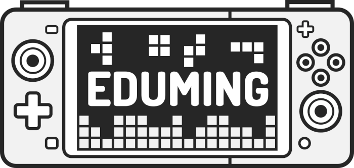
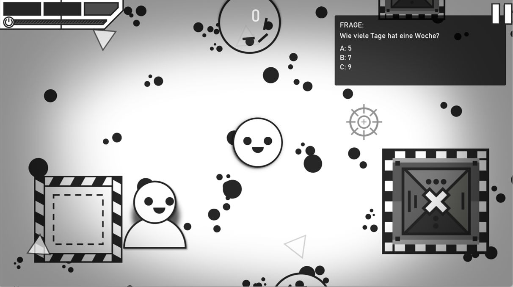
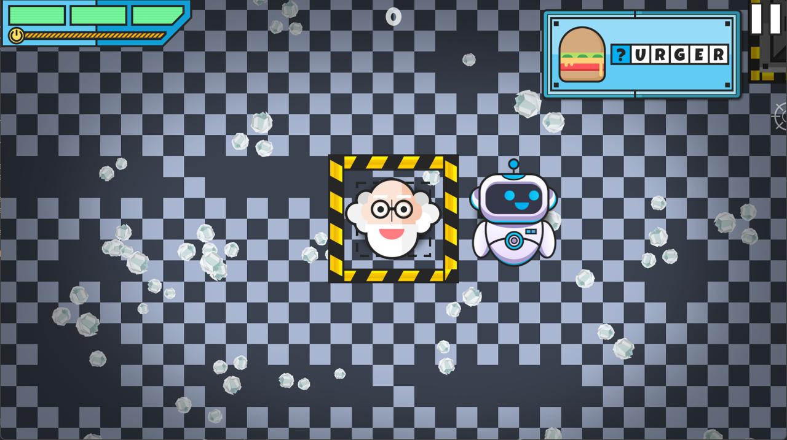
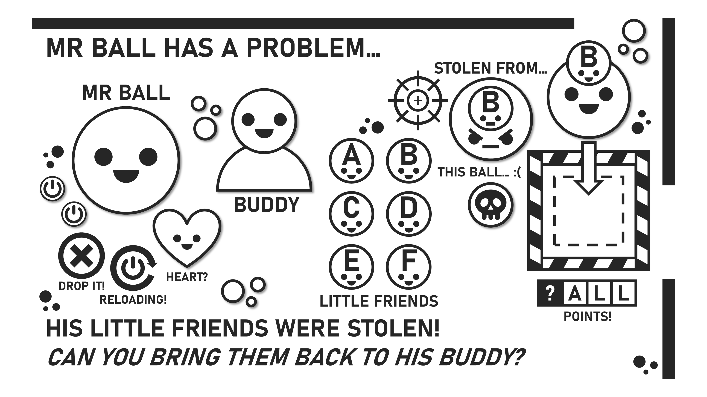

# EDUMING

_**Learning by Gaming, Coding, and Making.**_

> **Project description:**
>
> EDUMING is a constructionist game template concept inspired by Seymour Papert’s idea that learning is most powerful when learners create tangible artifacts and share them in social contexts. Instead of delivering a closed “serious game”, this repository provides **EDUMING 1 [PCLQ]** as an adaptable 2D arena-shooter template built with GameMaker Studio 2. The template includes a standardized learning mechanic (currently spelling / letter selection) that can be modified, extended, or even replaced. Educators and students are encouraged not only to _play_ the game, but also to _adapt and extend_ it step by step e.g., by changing difficulty, adding mechanics, or integrating new task types, before publishing their own variants via GX.GAMES.

> **⚠️ Work in Progress – Game Template**
>
> This EDUMING game template is under active development. New learning tasks, mechanics and code refactorings will be added step by step. While the project is already available for educational and research purposes, expect changes to the functional structure and some technical design decisions to be revised over time. If you use this template in teaching or research, please check back regularly for updates and versioning information.

---

## Preview

### Base Template

### Customized Example

You can try a customized example of **EDUMING 1 [PCLQ]** directly in the browser on GX.GAMES:  
[Play the customized example on GX.GAMES](https://gx.games/de/games/gy5ea2/eduming-1-pclq/tracks/4481e445-1b2c-45e6-8b74-c5dc840a15cb/)

---

## Learning Mechanic (Current Template Version)

The current template implements a **Fetch-and-Deliver** learning mechanic:

- The player moves through an arena and destroys enemies.  
- Defeated enemies drop **letters** that represent potential answers.  
- A task in the HUD indicates **which letter is currently required**.  
- The player must pick up the correct letter and deliver it to the central **Drop Zone**.  
- Correct deliveries award additional points; incorrect deliveries may deduct points.

In this version, the focus is on **spelling and initial letter recognition**, but the mechanic is designed as a reusable pattern. By adjusting the objects, variables and assets, the same template can be adapted for numbers, vocabulary, or completely different subject areas.

---

## Feature Overview (Short)

Below is a short description of the key objects and what each one does.

1. `obj_banner_complete` - "Game Complete" banner showing final score and updating the high-score table.
2. `obj_banner_lose` - "Game Over" banner that displays the final score and writes to highscores.
3. `obj_banner_pause` - Pause overlay that dims the screen while the game state is **PAUSED**.
4. `obj_banner_wave_clear` - Brief "Wave Clear" popup with fade-out.
5. `obj_banner_wave_incoming` - "Incoming Wave N" popup built from the current wave number.
6. `obj_button_continue` - Pause-menu **Continue**; unpauses on click or controller/ESC.
7. `obj_button_leaderboard` - Toggles the leaderboard panel on the splash/menu.
8. `obj_button_main_menu` - Returns to the main menu (room transition).
9. `obj_button_pause` - In-game pause button anchored near the camera; calls `pause_game()`.
10. `obj_button_play` - Starts gameplay from the splash screen.
11. `obj_button_quit` - Quits to OS or leaves the menu depending on build.
12. `obj_button_reload` - Orders the player to reload if applicable.
13. `obj_button_retry` - Restarts the gameplay room after a loss.
14. `obj_button_sound` - Global audio mute/volume toggle with sprite feedback.
15. `obj_ButtonQuitHTP` - Closes the "How-to-play" overlay, resets tutorial state, then destroys itself.
16. `obj_Donut` - Donut reward toggle for the letter task; reveals with bobbing motion and a short SFX.
17. `obj_DZ` - Central Drop Zone (EDUMING) used as the delivery/target area for the letter task.
18. `obj_enemy` - Core enemy AI: seeks player, separates from other enemies, navigates obstacles, takes damage, dies into `obj_enemy_dead`.
19. `obj_enemy_dead` - Death/VFX carrier that plays an effect and cleans itself up.
20. `obj_enemy_indicator` - Off-screen arrow pointing toward tracked enemies; fades in/out.
21. `obj_enemy_spawner` - Spawns enemies at arena edges with cooldown and on-screen caps.
22. `obj_game_manager` - The director: seeds RNG, music, HUD, arena grid, waves, and `GAME_STATE`; creates UI/touch controls and sets up the letter mini-task (Donut, Robo, Dropzone).
23. `obj_joystick` - On-screen virtual joystick base; provides touch axes.
24. `obj_joystick_left` - Left joystick anchor for movement.
25. `obj_joystick_right` - Right joystick anchor for aiming/shooting.
26. `obj_Letter` - Floating letter visual/pickup with jitter/glow; self-destructs on timer.
27. `obj_LetterDropHUD` - Desktop HUD hint for letter-drop; follows camera and fades based on flags.
28. `obj_LetterDropMOBILE` - Mobile/touch HUD for letter-drop; handles taps and clears delivery flags.
29. `obj_level_ground` — Ground tile holder for the arena grid.
30. `obj_level_wall` - Wall tile that selects the correct face sprite per corner/edge/gap.
31. `obj_MissingLetter` - Core "choose the correct initial letter" mini-game; validates delivered letters, awards score, triggers the donut reward.
32. `obj_obstacle` - Decorative/cover elements that participate in collision/repulsion.
33. `obj_paper` - Small ambient prop with randomized sprite/scale.
34. `obj_particle_handler` - Generic particle/VFX helper (e.g., smoke/trail hooks).
35. `obj_player` - The hero: input (kb/mouse/gamepad/touch), movement, aiming, firing, reloads, collisions; holds letter-delivery flags for the mini-game.
36. `obj_player_shoot` - Fire control: rate-limits shots, spawns projectiles, triggers muzzle VFX/SFX.
37. `obj_projectile` - Bullet logic: travel/rotation, damage, hit effects, screen shake, self-destruct on impact.
38. `obj_reload_hud_element` - Reload prompt that follows the player and fades in/out.
39. `obj_Robo` - Companion/NPC: idle bob; switches to a celebratory "love" state when the letter task is completed; pauses when the game is paused.
40. `obj_RoboButton` - Button that opens/sequences the "How-to-play" tutorial; hover/click scaling & SFX.
41. `obj_Screenshake` - Camera shaker that jitters for a duration and then recenters smoothly.
42. `obj_splash_manager` - Splash/main-menu controller: intro sequence, cursor handling, leaderboard panel, persistent high-score load/create.
43. `obj_touch_manager` - Touch router that assigns touches to the nearest joystick and forwards input.
44. `obj_TransitionMain` - General room-transition orchestrator; animates effect, performs `room_goto`, cleans up.
45. `obj_TransitionPixel` - Pixelation transition used when switching rooms (e.g., arena ↔ main menu).

---

## Requirements

- **GameMaker Studio 2** Depending on your system, you can download a free version. See the official GameMaker website for details and installers [Link](https://gamemaker.io/en)

## Getting Started

To use this template, you only need **GameMaker Studio 2**.

1. **Install GameMaker Studio 2**  
   - Download and install GameMaker Studio 2 from the official website.  
   - A free version is usually sufficient for trying out the template.

2. **Download this repository**  
   - Either clone it via Git:  
     `git clone https://github.com/stefanpietrusky/EDUMING_GAME_1_ARENA_SHOOTER_TEMPLATE.git`  
   - or use **“Download ZIP”** on GitHub and extract the folder on your machine.

3. **Open the project in GameMaker Studio 2**  
   - Start GameMaker Studio 2.  
   - Go to **File → Open** and select the `.yyp` project file from this repository.  
   - GameMaker will load all rooms, objects, sprites, and scripts.

4. **Run the base template**  
   - Press **Play** (Run) in GameMaker to test **EDUMING 1 [PCLQ]**.  
   - You can now play the arena shooter with the current learning mechanic.

5. **Create your own variant**  
   - Duplicate this project or create a new branch/fork.  
   - Adapt objects (e.g. `obj_MissingLetter`, `obj_game_manager`, `obj_Letter`, `obj_DZ`, `obj_Robo`) and assets to match your learning goals.  
   - When you are ready, you can publish your version to **GX.GAMES** (see section *Publish to GX.GAMES*).

## Who Is This Template For?

- **Educators / Teacher Trainers** who want to use a moddable game instead of a fixed “serious game”.  
- **Students / Pre-service teachers** who should learn by *modifying* and *extending* an existing game.  
- **Researchers** interested in constructionist, game-based learning scenarios.

## Basic Customization (First Steps)

If you want to adapt the current spelling mechanic:

- Start with `obj_MissingLetter` (letter task logic) and `obj_game_manager` (overall game and wave setup).  
- Replace the letter set and task logic to work with:
  - numbers (e.g. collect the correct result),
  - vocabulary (e.g. first letter of a word),
  - or other subject-specific symbols.  
- Adjust difficulty by changing:
  - enemy spawn rate in `obj_enemy_spawner`,
  - player health/damage in `obj_player`,
  - scoring rules in the mini-game logic.

---

## Publish to GX.GAMES

To publish your project to **GX.GAMES**, you can follow this official guide:

- **Publish to GX.GAMES tutorial [Link](https://gamemaker.io/de/tutorials/publish-to-gxgames-tutorial)**

If you want to publish a **performance-optimized build via YYC (YoYo Compiler)** for GX.GAMES, the **EMSCRIPTEN Software Development Kit (SDK)** is required. You can obtain it from the official repository:  
[emscripten-core / emsdk](https://github.com/emscripten-core/emsdk)

---

## License

- **Code:** Licensed under the **MIT License**. See `LICENSE`.
- **Assets (art, audio, fonts, logo, example GIFs, etc.):** Licensed under **CC BY-NC-ND** (Attribution–NonCommercial–NoDerivatives). See `ASSETS_LICENSE`.
- **Sound Effects:** Unless otherwise noted, sound effects originate from [ZapSplat](https://www.zapsplat.com/). If you use these SFX in your project or derivative works, you **must** include a visible reference to the site in your credits (e.g., “Sound effects by ZapSplat.com”).

> **Note:** You may use/modify the code freely under MIT, but the assets are **not** free for commercial use or redistribution/modification. Replace or remove any proprietary assets before publishing builds.

---

## How to Cite / Acknowledge

If you use or adapt EDUMING in academic or educational contexts, please add a short acknowledgment and a link back to this repository.

### Citation File (`CITATION.cff`)

This repository includes a `CITATION.cff` file in the root directory. You can:
- Use GitHub’s **“Cite this repository”** button to export BibTeX/APA/EndNote entries, or
- Parse `CITATION.cff` directly in your reference manager to cite the software appropriately.

---

## References
[1] Pietrusky, S. (2025). *Learning by gaming, coding and making with EDUMING: A new approach to utilising atypical digital games for learning*. arXiv:2504.13878 (cs.HC). https://arxiv.org/abs/2504.13878
